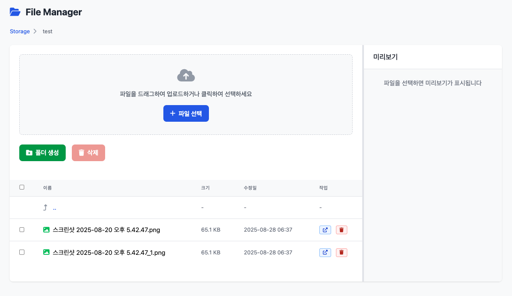

# Laravel File Manager

[](https://packagist.org/packages/ssh521/laravel-file-manager)
[](https://packagist.org/packages/ssh521/laravel-file-manager)
[](https://github.com/ssh521/laravel-file-manager/actions?query=workflow%3Arun-tests+branch%3Amain)
[](https://github.com/ssh521/laravel-file-manager/actions?query=workflow%3A"Fix+PHP+code+style+issues"+branch%3Amain)

A modern and elegant file manager for Laravel applications with drag & drop upload, folder management, and image preview capabilities built with **Tailwind CSS 4.0**.

📦 **GitHub Repository**: [https://github.com/ssh521/laravel-file-manager.git](https://github.com/ssh521/laravel-file-manager.git)

## Features

- 📁 **Folder Management**: Create, delete, and navigate through directories with breadcrumb navigation
- 📤 **File Upload**: Modern drag & drop interface with multi-file support
- 🖼️ **Image Preview**: Real-time preview for image files with responsive sizing
- 🗂️ **File Operations**: Batch delete files and folders with selection
- 🔒 **Security**: Advanced path traversal protection and configurable file restrictions
- 🎨 **Modern UI**: Built with **Tailwind CSS 4.0** for a clean, responsive interface
- 🔐 **Authentication**: Configurable middleware support (web, auth, admin)
- ⚙️ **Highly Configurable**: Extensive configuration options for all aspects
- 🌐 **Localization Ready**: Easy to customize text and labels
- 📱 **Mobile Responsive**: Works perfectly on all device sizes
- ✨ **No Dependencies**: Self-contained with CDN assets (Tailwind CSS 4.0 + Font Awesome 6)

## Screenshots



*Modern Tailwind CSS 4.0 interface with drag & drop functionality, breadcrumb navigation, and real-time image previews.*

## Installation

You can install the package via composer:

```bash
composer require ssh521/laravel-file-manager
```

The package will automatically register itself using Laravel's package auto-discovery.

### Publish Assets (Optional)

Publish the configuration file:

```bash
php artisan vendor:publish --tag=file-manager-config
```

Publish views for customization:

```bash
php artisan vendor:publish --tag=file-manager-views
```

### Storage Setup

Make sure your storage is properly linked:

```bash
php artisan storage:link
```

## Usage

### Basic Usage

The file manager will be automatically available at `/file-manager` route.

You can also create a link to the file manager in your application:

```php
<a href="{{ route('file-manager.index') }}" class="btn btn-primary">
    Open File Manager
</a>
```

### Configuration

After publishing the configuration file, you can customize the behavior in `config/file-manager.php`:

```php
return [
    // Storage paths
    'storage_path' => 'app/public',
    'public_path' => 'storage',

    // Route configuration
    'route' => [
        'prefix' => 'file-manager',
        'name' => 'file-manager',
        'middleware' => ['web', 'auth'], // Add authentication
    ],

    // UI configuration
    'title' => 'File Manager',
    'root_name' => 'Storage',
    'back_route' => null, // Optional back button route
    'back_text' => '돌아가기',

    // File upload configuration
    'max_file_size' => 10240, // KB (10MB)
    'allowed_mimes' => [], // Empty = allow all file types

    // Image file extensions for preview
    'image_extensions' => ['jpg', 'jpeg', 'png', 'gif', 'svg', 'webp'],

    // Security settings
    'forbidden_extensions' => ['php', 'js', 'html', 'htm'],
    'folder_name_pattern' => '/^[a-zA-Z0-9\-_\s]+$/',

    // Feature toggles
    'features' => [
        'upload' => true,
        'create_folder' => true,
        'delete' => true,
        'rename' => false, // Not implemented yet
        'move' => false,   // Not implemented yet
    ],
];
```

### Integration with Your Application

#### Add Navigation Link

```php
// In your admin panel or navigation
<a href="{{ route('file-manager.index') }}" class="nav-link">
    <i class="fas fa-folder"></i> File Manager
</a>
```

#### Custom Back Button

Set the back route in your config:

```php
'back_route' => 'admin.dashboard',
'back_text' => 'Back to Dashboard',
```

#### Middleware Protection

Configure authentication and authorization:

```php
'route' => [
    'middleware' => ['web'], // Basic web routes
    // or
    'middleware' => ['web', 'auth'], // Requires authentication
    // or  
    'middleware' => ['web', 'auth', 'admin'], // Requires authentication + admin role
],
```

## Configuration Options

### Storage Configuration

```php
'storage_path' => 'app/public',  // Laravel storage path
'public_path' => 'storage',      // Public URL path
```

### Route Configuration

```php
'route' => [
    'prefix' => 'admin/files',       // Custom URL prefix
    'name' => 'admin.files',         // Route name prefix
    'middleware' => ['web', 'auth'], // Route middleware
],
```

### File Upload Restrictions

```php
'max_file_size' => 5120,  // 5MB in KB
'allowed_mimes' => [
    'image/jpeg',
    'image/png', 
    'application/pdf',
],
'forbidden_extensions' => ['php', 'exe', 'bat'],
```

### UI Customization

```php
'title' => 'My File Manager',
'root_name' => 'Files',
'back_route' => 'dashboard',
'back_text' => 'Go Back',
```

## Security Features

- **Path Traversal Protection**: Prevents access outside storage directory
- **File Type Restrictions**: Configurable forbidden extensions
- **CSRF Protection**: All forms protected with CSRF tokens
- **Folder Name Validation**: Prevents malicious folder names

## API Endpoints

The package provides these endpoints:

- `GET /file-manager` - File manager interface
- `POST /file-manager/upload` - Upload files
- `POST /file-manager/create-folder` - Create new folder
- `DELETE /file-manager/delete` - Delete files/folders

## Customization

### Custom Views

Publish the views and modify them:

```bash
php artisan vendor:publish --tag=file-manager-views
```

Views will be published to `resources/views/vendor/file-manager/`

### Custom Styling

The package uses **Tailwind CSS 4.0** and **Font Awesome 6** icons loaded via CDN. You can override styles by publishing the views and adding custom CSS, or by customizing the Tailwind classes directly.

### Extending the Controller

You can extend the FileManagerController to add custom functionality:

```php
<?php

namespace App\Http\Controllers;

use Ssh521\LaravelFileManager\Http\Controllers\FileManagerController as BaseController;

class CustomFileManagerController extends BaseController
{
    public function index(Request $request)
    {
        // Add custom logic
        return parent::index($request);
    }
}
```

## Requirements

- PHP ^8.2
- Laravel ^11.0|^12.0
- Modern browser with JavaScript enabled
- Tailwind CSS 4.0 (included via CDN)
- Font Awesome 6 (included via CDN)

## Contributing

Please see [CONTRIBUTING](CONTRIBUTING.md) for details.

## Security

If you discover any security related issues, please email ssh521@naver.com instead of using the issue tracker.

## Credits

- [SSH521](https://github.com/ssh521)

## License

The MIT License (MIT). Please see [License File](LICENSE.md) for more information.

## Changelog

### v1.0.0
- 🎉 Initial release
- 📁 Complete file management functionality (upload, create folders, delete)
- 🎨 Modern **Tailwind CSS 4.0** interface
- 🖼️ Image preview with responsive sizing
- 🔒 Advanced security features (path traversal protection, file validation)
- 🔐 Configurable authentication middleware
- ⚙️ Comprehensive configuration options
- 📱 Mobile-responsive design
- ✨ Self-contained with CDN assets (no external dependencies)